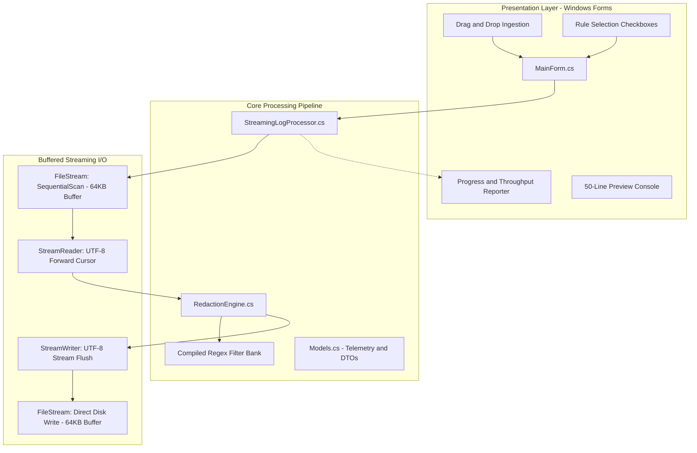
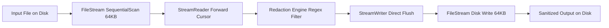
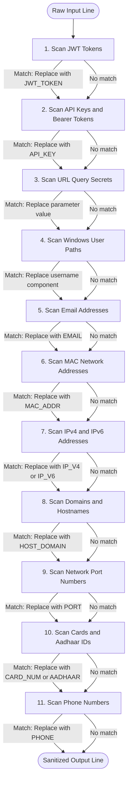
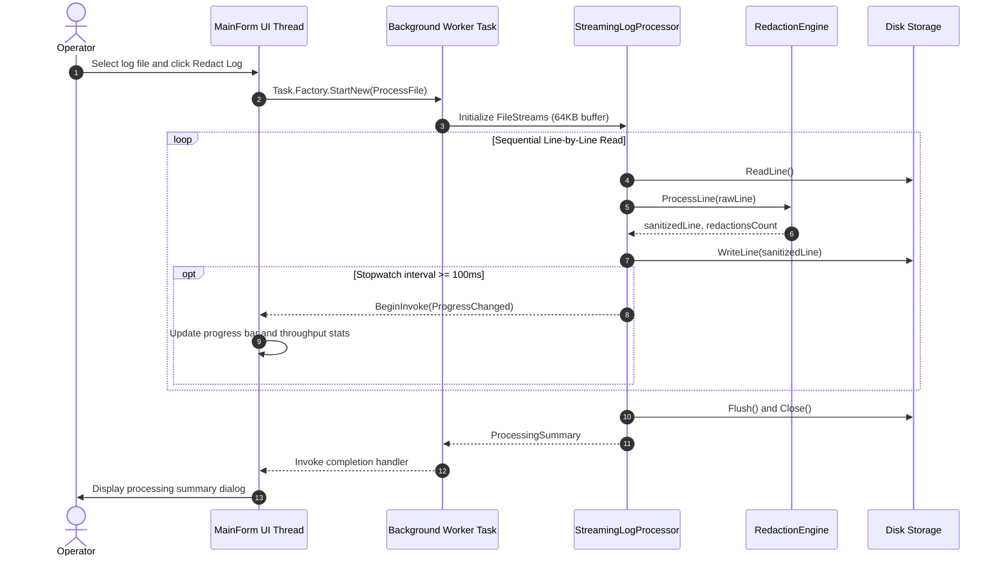

# Enterprise Log Redactor

Log Redactor is a high-performance Windows desktop utility engineered to sanitize sensitive data, credentials, network telemetry, personally identifiable information (PII), and host identifiers from enterprise log files.

The application operates as a standalone, zero-dependency executable (`LogRedactor.exe`). It runs on standard Windows installations without requiring external runtimes such as Python, Node.js, Electron, Java, or third-party dynamic libraries.

---

## Architecture Diagrams

### 1. System Architecture and Component Layering



### 2. Multi-Gigabyte Constant Memory Streaming Pipeline



### 3. Masking Rule Execution Order and Priority Filter Bank



### 4. Asynchronous Task Execution and Throttled Telemetry Flow



---

## Architectural Overview

### Multi-Gigabyte Streaming Pipeline
Traditional utilities load the entire file into memory (e.g. `File.ReadAllText`), resulting in `OutOfMemoryException` failures when processing large enterprise datasets. 

Log Redactor implements a bounded forward-only stream pipeline:
* **Memory Footprint**: Maintained at approximately 4.5 MB to 8 MB of working set RAM regardless of whether the log is 50 MB or 100 GB.
* **Throughput**: Optimized for maximum sequential I/O rates on NVMe, SSD, and enterprise SAN storage.
* **Non-Blocking UI**: Execution runs inside background worker tasks with rate-limited UI message marshaling.

---

## Redaction Rule Specifications

The redaction engine executes a prioritized filter bank using compiled, culture-invariant regular expressions:

| Target Pattern | Scope and Match Criteria | Replacement Tag |
|---|---|---|
| **JWT Tokens** | Base64 and Base64URL header-payload-signature tokens (`eyJ...`) | `[JWT_TOKEN]` |
| **API Keys & Credentials** | Bearer tokens, GitHub personal access tokens (`ghp_`), AWS Access Keys (`AKIA`), Slack tokens (`xoxb-`), and key-value secret pairs (`api_key=...`, `secret:...`) | `[API_KEY]` |
| **Sensitive URL Query Parameters** | Query parameters containing sensitive variables (`?token=...`, `&password=...`, `&session=...`) | `[REDACTED_URL_PARAM]` |
| **Windows User Paths** | Sanitizes user account directories (`C:\Users\<user>\...`) while preserving application directory hierarchy | `C:\Users\[USERNAME]\...` |
| **Email Addresses** | RFC-compliant email address structures | `[EMAIL]` |
| **MAC Addresses** | Colon, hyphen, or dot-separated physical network hardware addresses (`00:1A:2B:3C:4D:5E`, `001a.2b3c.4d5e`) | `[MAC_ADDR]` |
| **IPv4 Addresses** | Four-octet IPv4 addresses with 0–255 range validation boundaries | `[IP_V4]` |
| **IPv6 Addresses** | Full and compressed hexadecimal IPv6 notation | `[IP_V6]` |
| **Domains & Hostnames** | Enterprise FQDNs, internal domains (`.corp`, `.internal`, `.local`, `.lan`), and `host: ...` identifiers | `[HOST_DOMAIN]` |
| **Port Numbers** | Explicit TCP/UDP port notation (`:8080`, `port 443`, `port=8443`) | `[PORT]` |
| **Payment Cards / PAN** | 13-to-19 digit credit/debit card numbers with delimiter normalization | `[CARD_NUM]` |
| **Aadhaar Numbers** | 12-digit Indian national identity numbers | `[AADHAAR]` |
| **Phone Numbers** | Standard domestic and international telephone numbers | `[PHONE]` |

---

## User Interface Design

The user interface is built on native Windows Forms, customized for enterprise ergonomics:
* **Auto-Scaling Layout Architecture**: Dynamically computed control dimensions and layout anchoring prevent overlapping controls on all Windows display scaling modes (100%, 125%, 150%, 175%, 200%).
* **Drag-and-Drop Zone**: Direct drag-and-drop ingestion of `.log`, `.txt`, `.csv`, `.out`, `.json` files.
* **Network & PII Masking Bank**: Granular checkboxes to enable or disable individual pattern detectors across network addresses, ports, domains, hostnames, and credentials.
* **Interactive Preview**: Scans and displays the first 50 lines with active masking rules applied before initiating full-file processing.
* **Asynchronous Cancellation**: Thread-safe cancellation token integration that stops I/O operations cleanly upon request.

---

## Source Structure

```
LogRedactor/
├── LogRedactor.csproj          # .NET SDK project configuration
├── Program.cs                  # Entry point
├── MainForm.cs                 # Windows Forms user interface implementation
├── RedactionEngine.cs          # Regular expression filter bank and rule evaluator
├── StreamingLogProcessor.cs    # Multi-GB buffered stream engine
├── Models.cs                   # Configuration parameters and telemetry data models
├── GenerateSampleLogs.cs       # Multi-MB enterprise test log generator
├── build.bat                   # Automation script for native compilation
└── README.md                   # System documentation
```

---

## Build Instructions

### Method 1: Native Windows Compiler (Zero Installation)
Compile directly on any standard Windows machine using the built-in Microsoft .NET Framework C# compiler (`csc.exe`):

```cmd
build.bat
```

### Method 2: .NET 8 / Modern .NET SDK
Compile and publish a self-contained single-file executable using the .NET CLI:

```bash
dotnet publish -c Release -r win-x64 --self-contained true -p:PublishSingleFile=true -o ./publish
```

---

## Generating Test Data

To generate synthetic enterprise server logs for validation and throughput benchmarking:

```cmd
csc /target:exe /out:GenerateSampleLogs.exe GenerateSampleLogs.cs
GenerateSampleLogs.exe 35000
```

This creates a realistic test file (`enterprise_test_sample.log`) populated with network ports, MAC addresses, hostnames, FQDNs, access tokens, API calls, and PII events.
